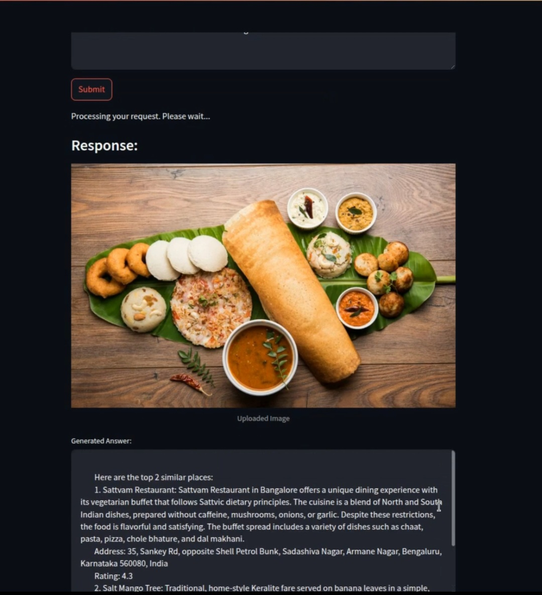
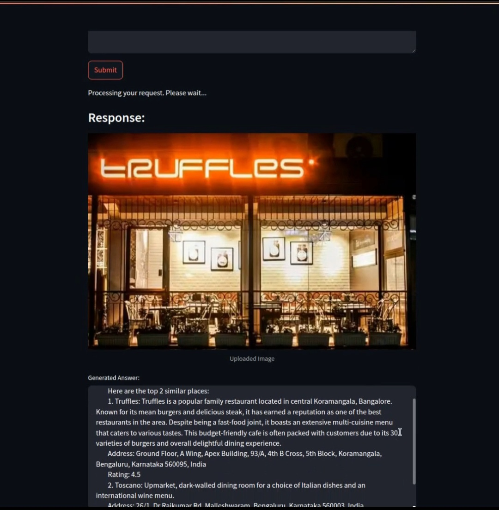

# 🌟 AI-Powered Food Discovery Pipeline 🍔🍕🍜
Welcome to the AI-Powered Food Discovery Pipeline repository! 
This project combines state-of-the-art Visual Language Models (VLMs) and vector database technology to redefine how we discover food and restaurants.🍽️✨
___________________________________________________________________________________________________________________________________________________________

## 🌍 Overview
This pipeline allows users to:

1. Upload an image of a food item or restaurant banner.
2. Combine visual insights with natural language queries.
3. Retrieve and recommend similar restaurants or dishes from a curated knowledge base (currently optimized for Bangalore, with global scalability potential 🌏).

Whether you're exploring new cuisines or hunting for the perfect dining experience, this AI-powered tool bridges the gap between visual discovery and actionable recommendations.
## ✨ Key Features
1. 🖼️ Image-to-Insight Processing : 
    Utilizes BLIP-2 to extract meaningful captions from uploaded images, such as “wood-fired pizza” or “modern bistro vibes.”
   
2. 🧠 Contextual Understanding : 
    Combines the extracted image caption with user queries (e.g., “Where can I find similar places nearby?”).
   
4. 🗺️ Vector Database for Recommendations : 
    A FAISS vector database stores precomputed embeddings of restaurants and dishes.
    Performs similarity matching to recommend the top 2 most relevant places.
   
5. 📖 Custom Knowledge Base : 
    Includes restaurant metadata such as name, description, address, and ratings.
   
6. 🌐 Scalable Potential : 
   Currently optimized for Bangalore, but designed for global scalability.

   
## 🚀 Pipeline Workflow
1. Input :
   User uploads an image of a food item or restaurant banner. Provides a text query (e.g., 🗨️ “Find similar dishes near me.”).

3. Image Captioning : 
    BLIP-2 extracts captions summarizing the content of the image.
   
5. Query Enrichment : 
    Combines the image caption, user query, and user location (latitude and longitude).
   
7. Vector Search : 
    Queries the FAISS vector database to find the top 2 similar places.
   
9. Output Generation : 
    Returns detailed recommendations, including names, descriptions, addresses, and ratings of the matched places.


## 📸 **Screenshots & Demo**

### 🖼️ **Sample Output Screenshot**  
  
  


## 🛠️ Installation
1. Clone this repository:
```
git clone https://github.com/your-username/ai-food-discovery-pipeline.git  
cd AI-FOOD-DISCOVERY-PIPELINE
```

2. Install required dependencies:
```
pip install -r requirements.txt
```

## 📖 Usage
1. Add your knowledge base in JSON format (refer to eateries_knowledge_base.json for the structure).
2. Run the pipeline:
```
redis-server --daemonize yes && streamlit run streamlit_app.py
python3 worker.py
```
3. View the output with recommended places and details.

## 🙌 Acknowledgments
1. 🤗 Hugging Face for BLIP-2 and SentenceTransformers.
2. 🔬 Meta AI for advancements in Visual Language Models.
3. 🧮 FAISS for efficient vector similarity search.

## 🎉 Explore, Discover, and Indulge with AI!
Feel free to share your feedback, suggestions, and ideas. Let’s shape the future of food discovery together! 🍔💡

